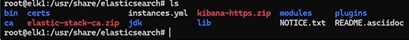
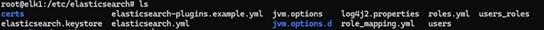

**Step1: create instance.yml file which we will use in generate certificate.**

*Created this file: in elk1 for save password*

*Created this file for make an* `instances.yml` *file.*  
`root@elk1:/usr/share/elasticsearch# cat instances.yml`

instances:

```
    - name: "elasticsearch"
      ip:
        - "192.168.0.121"
    - name: "elasticsearch2"
      ip:
        - "192.168.0.122"
    - name: "elasticsearch3"
      ip:
        - "192.168.0.123"
    - name: "kibana"
      ip:
        - "192.168.0.123"
    - name: "fleet"
      ip:
        - "192.168.0.123"
```

**Step2: Generate certificate on node1.**

`Cd /usr/share/elasticsearch/`

`sudo bin/elasticsearch-certutil ca --pem`

*keep output file default when ask just hit enter do not give any value.*

`sudo apt install zip unzip -y`

`sudo unzip elastic-stack-ca.zip`

`sudo /usr/share/elasticsearch/bin/elasticsearch-certutil cert --ca-cert ca/ca.crt --ca-key ca/ca.key --pem --in instances.yml --out kibana-https.zip`

`sudo unzip -d certs kibana-https.zip`



cp ca/ca.crt certs/

mv certs/ ~/

cd ~/

**Step3: Copy the same cert folder to all hosts, we are copying in /root for all with ca.cert file**

scp -r certs root@elk1:/


scp -r certs root@elk2:/


scp -r certs root@elk3:/


**Step4: Copy certificates files to** `/etc/elasticsearch/certs/` and change the group of folders

**IN ELK1:**

cd /root/certs/

cp ca.crt elasticsearch/

cd elasticsearch


cd ..

mv elasticsearch /etc/elasticsearch/certs/


cd /etc/elasticsearch/



chgrp -R elasticsearch certs/

**In ELK2:**

`cd /root`

`cd certs/`

`cp ca.crt elasticsearch2/`

`mv elasticsearch2/ /etc/elasticsearch/certs/`

`chgrp -R elasticsearch /etc/elasticsearch/certs/`

**In ELK3:**

`cd /root`

`cd certs/`


`cp ca.crt elasticsearch3/`

`cp ca.crt fleet/`

`cp ca.crt kibana/`

`mv elasticsearch3/ /etc/elasticsearch/certs/`

`mkdir /etc/kibana/certs`

`mv kibana/ /etc/kibana/certs/`

`chown -R kibana:kibana /etc/kibana/certs`

`chgrp -R elasticsearch /etc/elasticsearch/certs/`

**Setup Certificates for kibana:**

`cd /etc/kibana/certs/kibana`

`mv * ../`


