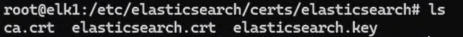
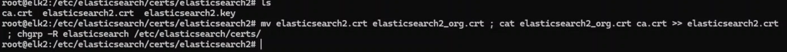

**IN ELK1:**

`Cd /etc/elasticsearch/certs/elasticsearch/`

**If there is any issue/doubt here, please copy the generated certificate again, which we generated.**

`cp ca.crt elasticsearch/`

`mv elasticsearch/ /etc/elasticsearch/certs/`

`cd /etc/elasticsearch/certs/elasticsearch`

`mv elasticsearch.crt elasticsearch_org.crt ; cat elasticsearch_org.crt ca.crt >> elasticsearch.crt ; chgrp -R elasticsearch /etc/elasticsearch/certs/`

***Verify command from image twice before run.***

***IN ELK2:***

`mv elasticsearch2.crt elasticsearch2_org.crt ; cat elasticsearch2_org.crt ca.crt >> elasticsearch2.crt ; chgrp -R elasticsearch /etc/elasticsearch/certs/`

**IN ELK3:**

`mv elasticsearch3.crt elasticsearch3_org.crt ; cat elasticsearch3_org.crt ca.crt >> elasticsearch3.crt ; chgrp -R elasticsearch /etc/elasticsearch/certs/`

