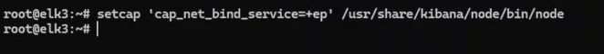

**ON ELK3:**

`setcap ‘capnetbind_service=+ep’ /usr/share/kibana/node/bin/node`

Enter Command:

`crontab -e`

Enter the below given content in the file and save

`@reboot setcap 'cap_net_bind_service=+ep' /usr/share/kibana/node/bin/node`

> `This above steps are recommended also we need to do if kibana is not running.`

`systemctl status kibana`

`systemctl restart kibana`

`systemctl status kibana`

When we see status the red mark line should come. else see logs what we done mistake and where.
